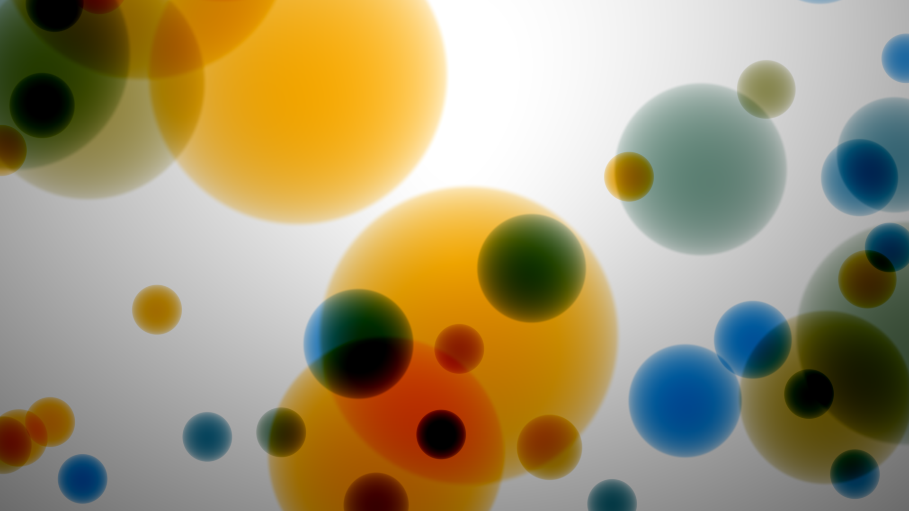

# RunShadertoy
Run Shadertoy shaders in desktop OpenGL.

Inspired by [shadertoy](https://www.shadertoy.com/) and [shadertoy-render](https://github.com/alexjc/shadertoy-render).

## Compiling
```Shell
make
```

## Usage
1. Copy a shader on [Shadertoy](https://www.shadertoy.com/) into a file, `shader.glsl` for example.
2. Run the shader in desktop OpenGL:
```Shell
./run shader.glsl
```
or with specific resolution:
```Shell
./run example.glsl 1920 1080
```

## Dependencies
[GLFW - An OpenGL library](http://www.glfw.org/)

[GLEW - The OpenGL Extension Wrangler Library](http://glew.sourceforge.net/)

## Screenshots
["Seascape" by TDM](https://www.shadertoy.com/view/Ms2SD1)


["The Cornell Box" by h3r3](https://www.shadertoy.com/view/4ssGzS)


["Deform - flower" by iq](https://www.shadertoy.com/view/4dX3Rn)


["Bubbles" by iq](https://www.shadertoy.com/view/4dl3zn)

